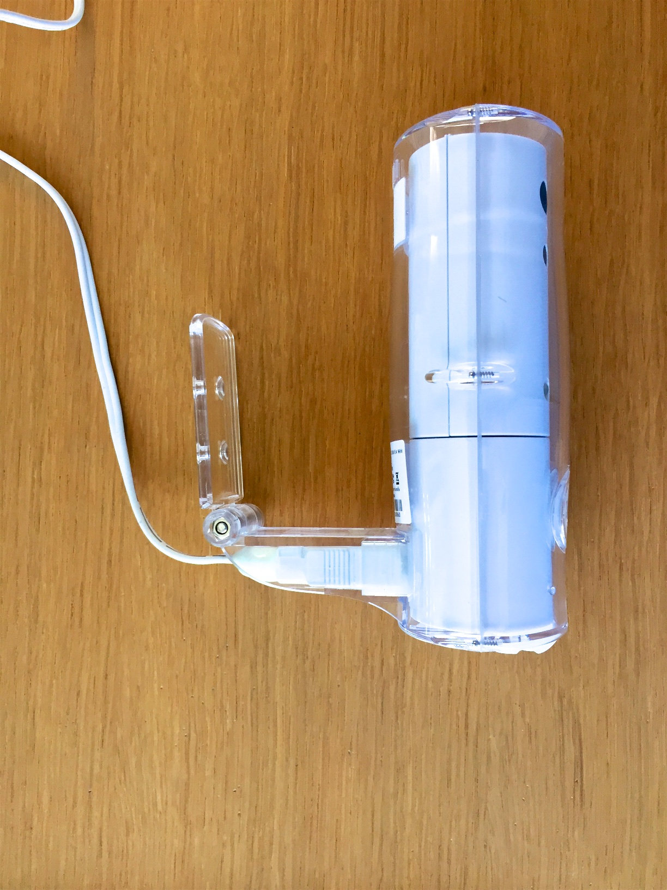
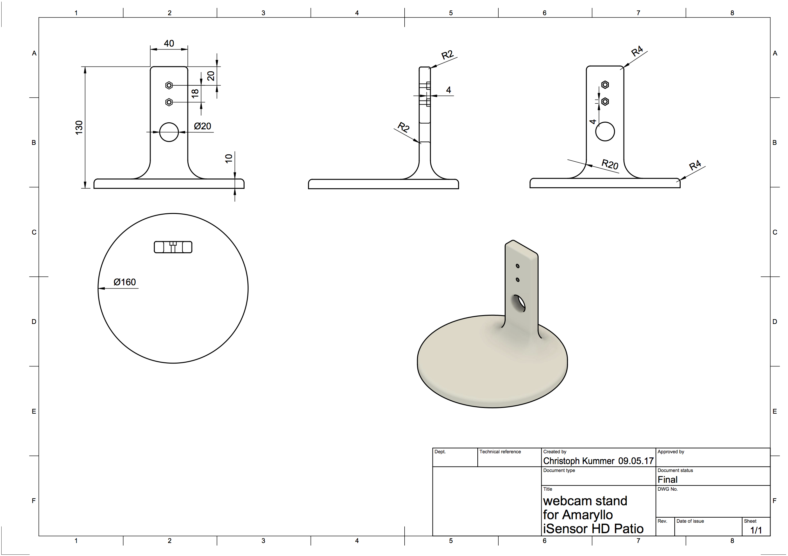
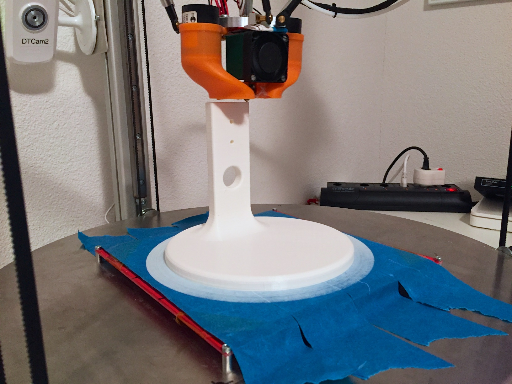
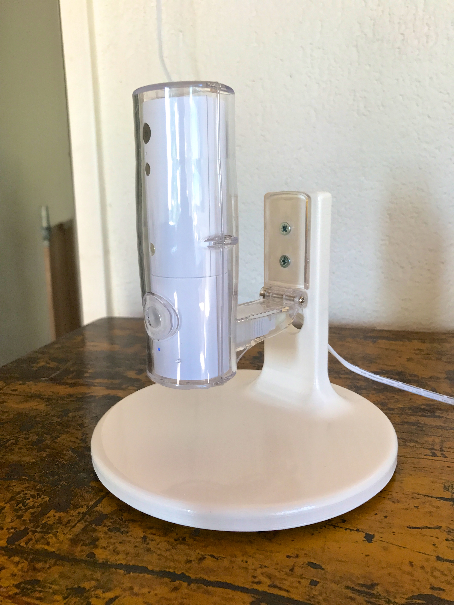
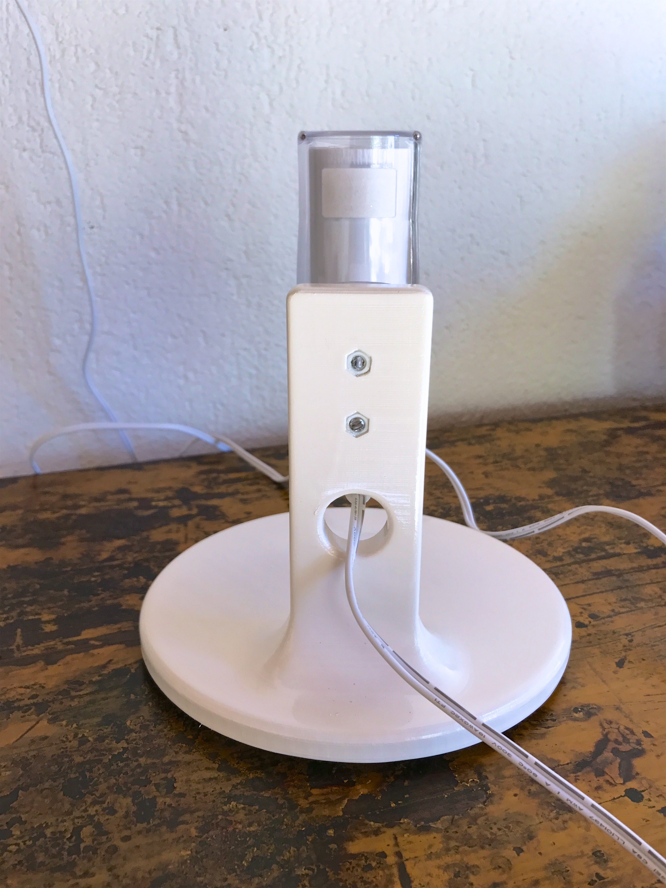
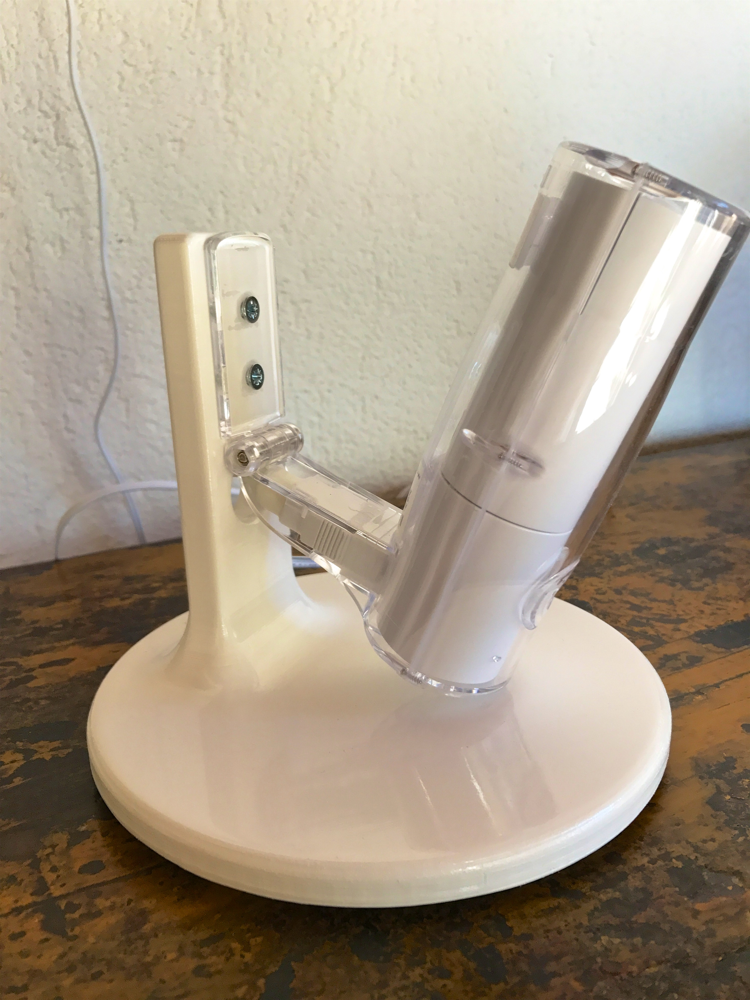

# WebCamStand4Roland
Web Cam Stand for Roland's Amaryllo iSensor Patio Web Cam: 

   http://www.amaryllo.eu/n60104/prod_patio/

This was my first design using Autodesk Fusion 360. The original model may be found here:

   http://a360.co/2pPlROI

## The WebCam

## Design Drawing

## 3D Print

## In Use

## Video
You may find the Videos here: [Vimeo](https://vimeo.com/216955916) or [YouTube](https://www.youtube.com/watch?v=sUn45yteBiw)

## Tools
* Autodesk Fusion360 [Product Page](http://autodesk.com/products/fusion-360/overview) more information about [Hobbyist and Education License](https://www.autodesk.com/products/fusion-360/students-teachers-educators)
* Ultimaker Cura Slicing Software [Product Page](http://ultimaker.com/en/products/cura-software)
* Deltatower 3D Printer [Home Page](https://deltatower.ch/)
* my3Dfilament PLA 2.85 mm white [Product Page](http://www.3dstore.ch/filament/my3dfilament/my3dfilament-pla-2-85mm/my3dfilament-mf-pla-2-85mm-weiss.html)
